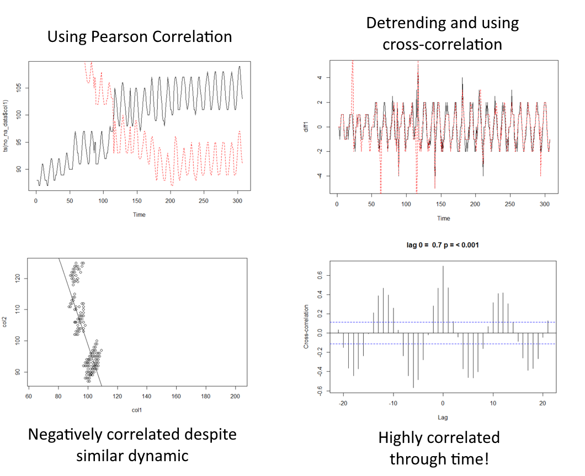
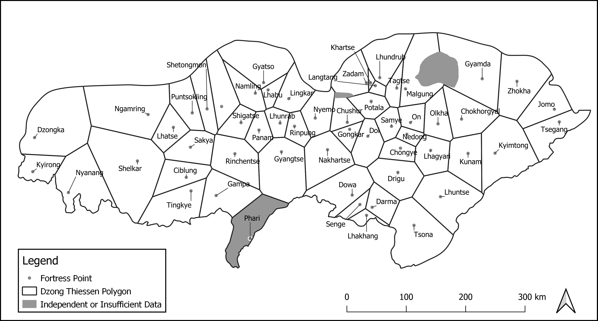
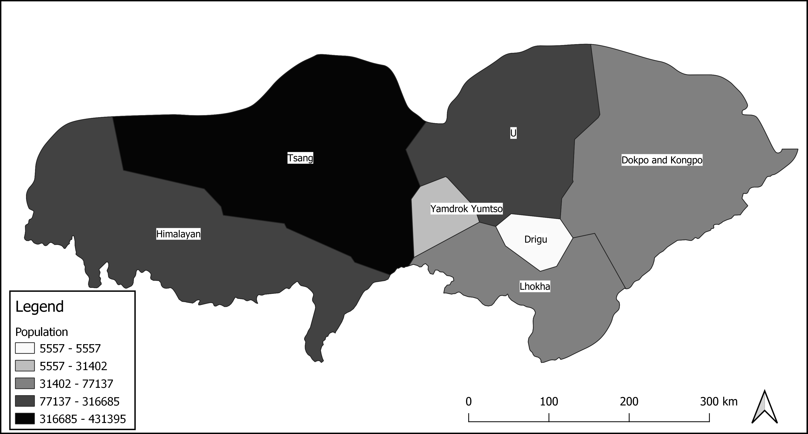

Data Analyst Portfolio
================
Rocco Bowman
2022-06-29

<style type="text/css">
  body{
  font-size: 14pt;
}
</style>

# By Skill

## SQL

### Increasing Web Engagement and Internal Organization

I employ SQL while consulting for UC Merced’s only specialized
undergraduate research journal—The Undergraduate Historical Journal
(UHJ), which I and a small band of dedicated students founded in 2013.
Successive generations of undergraduates continue to manage this online,
open-access journal and submit articles for peer-review and publication.
While I am no longer an editor, I still summarize and analyze web
traffic data and make recommendations to the editorial board.

Data provided by the publication platform eScholarship, along with
careful analysis, gives me the intelligence I need to recommend policies
that best serve readers and authors. Web traffic also informs
recommendations about optimal times to publish and, in turn, when and
how to sequence pre-publication tasks such as marketing, editing,
designing, and formatting.


### Preparing data

I always start by looking at the overall engagement data for the latest
month compared to previous months to get a quick read on how the journal
is doing. The raw data provided by eScholarship does not fit the needs
of the editors out-of-the-box so viewing and cleaning is necessary.

-   Month
-   Deposits (# of articles published for the month)
-   total_requests (downloads + view only)
-   downloads (number of articles downloaded
-   view_only (number of views but no downloads)
-   perc_downloads (ratio of downloads to total engagement)

``` sql
SELECT * 
FROM breakdown_by_month
ORDER BY Month DESC
LIMIT 10;
```

| Month   | Deposits | total_req | Download | view_only | perc_dnld |
|:--------|---------:|----------:|---------:|----------:|----------:|
| 2022-05 |       NA |      1758 |      450 |      1308 |      25.6 |
| 2022-04 |       NA |      2515 |      812 |      1703 |      32.3 |
| 2022-03 |       NA |      2144 |      487 |      1657 |      22.7 |
| 2022-02 |       NA |      1743 |      394 |      1349 |      22.6 |
| 2022-01 |       NA |      1683 |      426 |      1257 |      25.3 |
| 2021-12 |        8 |      2099 |      559 |      1540 |      26.6 |
| 2021-11 |       NA |      2724 |      702 |      2022 |      25.8 |
| 2021-10 |       NA |      2786 |      814 |      1972 |      29.2 |
| 2021-09 |       NA |      2108 |      603 |      1505 |      28.6 |
| 2021-08 |       NA |      1401 |      371 |      1030 |      26.5 |

Displaying records 1 - 10

### Transforming the date column

We can see that the only time stamp for this databases is a
concatenation of a four-character year and a two-character month such as
2022-05. If we want to perform queries with temporal partitions, it
would be best to create both a year and a month column. This will also
allow us to get a better read on seasonality by comparing, for example,
all July data to inspect whether low total are normal or anomalous.

``` sql
SELECT
  SUBSTRING(Month,1,4) AS Y,
  SUBSTRING(Month,6,2) AS M,
  *
FROM breakdown_by_month
```

| Y    | M   | Month   | Deposits | total_req | Download | view_only | perc_dnld |
|:-----|:----|:--------|---------:|----------:|---------:|----------:|----------:|
| 2022 | 05  | 2022-05 |       NA |      1758 |      450 |      1308 |      25.6 |
| 2022 | 04  | 2022-04 |       NA |      2515 |      812 |      1703 |      32.3 |
| 2022 | 03  | 2022-03 |       NA |      2144 |      487 |      1657 |      22.7 |
| 2022 | 02  | 2022-02 |       NA |      1743 |      394 |      1349 |      22.6 |
| 2022 | 01  | 2022-01 |       NA |      1683 |      426 |      1257 |      25.3 |
| 2021 | 12  | 2021-12 |        8 |      2099 |      559 |      1540 |      26.6 |
| 2021 | 11  | 2021-11 |       NA |      2724 |      702 |      2022 |      25.8 |
| 2021 | 10  | 2021-10 |       NA |      2786 |      814 |      1972 |      29.2 |
| 2021 | 09  | 2021-09 |       NA |      2108 |      603 |      1505 |      28.6 |
| 2021 | 08  | 2021-08 |       NA |      1401 |      371 |      1030 |      26.5 |

Displaying records 1 - 10

### Keeping tabs on overall engagement

Keeping editors updated on month-over-month or year-over-year engagement
is vital because it provides the highest level summary of product
fitness—are the numbers up or down? How many engagements have the
journal accumulated to date? And what is the average engagement for each
month?

``` sql
WITH clean_date AS (
SELECT
  SUBSTRING(Month,1,4) AS Y,
  SUBSTRING(Month,6,2) AS M,
  *
FROM breakdown_by_month
)


SELECT
  *,
    SUM(total_req) OVER(ORDER BY Month
        ROWS BETWEEN UNBOUNDED PRECEDING AND CURRENT ROW) AS Tr_running_total,
    SUM(Download) OVER(ORDER BY Month
        ROWS BETWEEN UNBOUNDED PRECEDING AND CURRENT ROW) AS D_running_total,
    AVG(total_req) OVER(ORDER BY Month
        ROWS BETWEEN 6 PRECEDING AND CURRENT ROW) AS Tr_avg,
    AVG(Download) OVER(ORDER BY Month
        ROWS BETWEEN 6 PRECEDING AND CURRENT ROW) AS D_avg
FROM clean_date
ORDER BY Month DESC;
```

| Y    | M   | Month   | Deposits | total_req | Download | view_only | perc_dnld | Tr_running_total | D_running_total |   Tr_avg |    D_avg |
|:-----|:----|:--------|---------:|----------:|---------:|----------:|----------:|-----------------:|----------------:|---------:|---------:|
| 2022 | 05  | 2022-05 |       NA |      1758 |      450 |      1308 |      25.6 |            78900 |           25148 | 2095.143 | 547.1429 |
| 2022 | 04  | 2022-04 |       NA |      2515 |      812 |      1703 |      32.3 |            77142 |           24698 | 2242.000 | 599.1429 |
| 2022 | 03  | 2022-03 |       NA |      2144 |      487 |      1657 |      22.7 |            74627 |           23886 | 2183.857 | 569.2857 |
| 2022 | 02  | 2022-02 |       NA |      1743 |      394 |      1349 |      22.6 |            72483 |           23399 | 2077.714 | 552.7143 |
| 2022 | 01  | 2022-01 |       NA |      1683 |      426 |      1257 |      25.3 |            70740 |           23005 | 2003.714 | 537.4286 |
| 2021 | 12  | 2021-12 |        8 |      2099 |      559 |      1540 |      26.6 |            69057 |           22579 | 2096.571 | 574.8571 |
| 2021 | 11  | 2021-11 |       NA |      2724 |      702 |      2022 |      25.8 |            66958 |           22020 | 2088.143 | 573.8571 |
| 2021 | 10  | 2021-10 |       NA |      2786 |      814 |      1972 |      29.2 |            64234 |           21318 | 2034.143 | 589.5714 |
| 2021 | 09  | 2021-09 |       NA |      2108 |      603 |      1505 |      28.6 |            61448 |           20504 | 2090.857 | 576.2857 |
| 2021 | 08  | 2021-08 |       NA |      1401 |      371 |      1030 |      26.5 |            59340 |           19901 | 2259.143 | 580.4286 |

Displaying records 1 - 10

### Determining date to publish and pre-publication tasks

The editorial board turns over each semester, and most work finishes
during the semester. Therefore, developing an organized sequence of
tasks leading up to publication within about three months is essential
to optimizing readership.

By summarizing engagement within month bins, I can directly address the
question of when articles should be published to optimize potential
readership. As it turns out, the end of each semester is the busiest
(October, November, April), while academic recesses (January, July,
August) are the slowest.

Therefore, I recommend having articles ready to publish in April and
November when students are conducting their literature reviews to
maximize the immediate impact of any article. Better metrics mean
happier authors who become repeat authors.

``` sql
WITH clean_date AS (
  SELECT
    SUBSTRING(Month,1,4) AS Y,
    SUBSTRING(Month,6,2) AS M,
    *
  FROM breakdown_by_month
)
,

month_average AS (
  SELECT
    M AS Month,
    AVG(total_req) OVER(PARTITION BY M) as month_avg
  FROM clean_date
  GROUP BY M
  ORDER BY month_avg DESC)
,
  
avg_rank AS (
  SELECT
    *,
    RANK() OVER(ORDER BY month_avg) AS month_rank
  FROM month_average
  ORDER BY month_rank ASC
)
  

SELECT *
FROM avg_rank
WHERE month_rank < 4
UNION
SELECT *
FROM avg_rank
WHERE month_rank > 9
ORDER BY month_rank ASC;
```

| Month | month_avg | month_rank |
|:------|----------:|-----------:|
| 07    |      1225 |          1 |
| 08    |      1401 |          2 |
| 01    |      1683 |          3 |
| 04    |      2515 |         10 |
| 11    |      2724 |         11 |
| 10    |      2786 |         12 |

6 records

### Personalizing metrics

The editors want a better understanding of the engagement patterns of
readers but also repeat engagement and buy-in from authors. Informing
authors of their personal milestones with the journal can be an
effective way to leverage data and establish regular contact. I provide
a version of author metrics per article and an overall summary.

``` sql
SELECT
  a.author,
  a.Title,
  i.[Total.requests],
  IFNULL(i.[X2022.06],0) AS this_month,
  IFNULL(i.[X2022.05],0) AS last_month,
  (IFNULL(i.[X2022.06],0) - IFNULL(i.[X2022.05],0)) AS change
FROM authors_by_item AS a
LEFT JOIN history_by_item AS i
ON a.Title = i.Title
ORDER BY author;
```

| author               | Title                                                                                              | Total.requests | this_month | last_month | change |
|:---------------------|:---------------------------------------------------------------------------------------------------|---------------:|-----------:|-----------:|-------:|
| Alhomady, Acksah     | Christian and Jewish Arab-American Identities Beyond September 11                                  |             79 |          0 |          0 |      0 |
| Allen, Adam          | The Role of Women in Africa: 5000 BCE-Late Antiquity                                               |            282 |          1 |          6 |     -5 |
| Anthony, Mitchell T. | Religion and Politics in the Greek Successor States after the Fourth Crusade (1204)                |            127 |          0 |          0 |      0 |
| Arredondo, Niko      | The Forgotten Soldiers: Mexican-American Soldiers of WWII and the Creation of the G.I. Forum       |           3857 |         34 |         62 |    -28 |
| Barragan, Ramon      | Reasoning from Race: Feminism, Law and the Civil Rights Revolution by Serena Mayeri                |            274 |          1 |          3 |     -2 |
| Barragan, Ramon      | The Nixon Reconfiguration: American Foreign Policy in the Middle East, 1969-1974                   |            143 |          2 |          2 |      0 |
| Blondin, Trevor      | Soviet Intervention in Afghanistan, the Saur Revolution and the Cold War                           |           1516 |         26 |         44 |    -18 |
| Bov<e9>e, Parker     | Shifting Gender Norms Through Cinema: Physical Spaces and Cultural Ideals of 1920s Shanghai Cinema |            191 |          6 |          3 |      3 |
| Bowman, Rocco        | Review of The Name of War: King Philip’s War and the Origins of American Identity                  |           1564 |          0 |          3 |     -3 |
| Bowman, Rocco        | Bounded Empires: Ecological and Geographic Implications in Sino- Tangut Relations, 960-1127        |            899 |          8 |         16 |     -8 |

Displaying records 1 - 10

### Summarizing by author

``` sql
WITH author_engage AS (
SELECT
  a.author,
  a.Title,
  i.[Total.requests],
  IFNULL(i.[X2022.06],0) AS this_month,
  IFNULL(i.[X2022.05],0) AS last_month,
  (IFNULL(i.[X2022.06],0) - IFNULL(i.[X2022.05],0)) AS change
FROM authors_by_item AS a
LEFT JOIN history_by_item AS i
ON a.Title = i.Title
ORDER BY author)

SELECT
  author,
  [Total.requests],
  this_month,
  last_month,
  change
FROM author_engage
GROUP BY author
ORDER BY [total.requests] DESC;
```

| author                 | Total.requests | this_month | last_month | change |
|:-----------------------|---------------:|-----------:|-----------:|-------:|
| Racco, Peter           |           4884 |         57 |        101 |    -44 |
| Arredondo, Niko        |           3857 |         34 |         62 |    -28 |
| Escobar, Summer        |           3443 |         52 |         84 |    -32 |
| Langer, Nicholas       |           2750 |         63 |         53 |     10 |
| Zetina, Brenda         |           2722 |         58 |         69 |    -11 |
| Moreno, Cecilia        |           2164 |         23 |         81 |    -58 |
| Lan, Aaron             |           1977 |          6 |          4 |      2 |
| Pirir, Juan Francisco  |           1799 |         14 |         40 |    -26 |
| Park, Chul Wan Soloman |           1773 |          3 |          4 |     -1 |
| Ramirez, Maya C.       |           1657 |         48 |        111 |    -63 |

Displaying records 1 - 10

### Better Serving Readers, Authors, and Editors

I utilized SQL to better understand website engagement data which, in
turn, gave me intelligence about how best to serve journal users and
authors as well as internally organize tasks like marketing, training,
and reviewing. I found SQL particularly useful when managing the
relational databases provided by our data provider.

## R Statistics

### Identifying market regions

I employ the R statistical package often to perform end-to-end data
analysis from cleaning to visualization. In one case, I was approached
by the chair of my dissertation committee who, along with a collaborator
at a different university, were attempting to leverage a novel data set
into a new article. They had already received comments back from
reviewers but needed a new approach in order to better understand
correlations between grain price time series from 1736 to 1911, limit
the correlations to spatial neighbors, and visualize the strongly
correlated cities as visual clusters. This article is current under
review at *Social Science History*.

### Preparing the data

The data in question is a monthly tabulation of high and low grain
prices for each city. The initial format did not lend itself to easy
time-series analysis as I wanted each city to be the column headers with
each row representing a single month’s grain price average.

### Reading in data

``` r
# 1. Read in data ---------------------------------------------------------

  library(readxl)
  
  # set whatever folder is holding the data on your machine
  # setwd("~/Grain Price Project")
  
  # create a subdirectory to hold all future outputs if none exists
  if (dir.exists(file.path(getwd(), 'output')) == TRUE) {
    print("Sub-directory found")
  } else {
  dir.create(file.path(getwd(), 'output'))
  }
```

    ## [1] "Sub-directory found"

``` r
  # read in excel spreadsheet
  price_data <- read_xls("data/allgrain_W1.xls")
  
  #view data
  print(head(price_data))
```

    ## # A tibble: 6 × 33
    ##   grain prov  W1_ID 地區  糧別     year mo01_lo mo01_hi mo02_lo mo02_hi mo03_lo
    ##   <chr> <chr> <chr> <chr> <chr>   <dbl>   <dbl>   <dbl>   <dbl>   <dbl>   <dbl>
    ## 1 wheat ah    AH    安徽  小麥、…  1738    NA      NA      NA      NA      NA  
    ## 2 wheat ah    AH    安徽  小麥、…  1739    79.9   112.     82.2   116.     81.6
    ## 3 wheat ah    AH    安徽  小麥、…  1740    NA      NA      NA      NA      NA  
    ## 4 wheat ah    AH    安徽  小麥、…  1741    63.5    86.2    64.6    86.3    65.8
    ## 5 wheat ah    AH    安徽  小麥、…  1742    85.7   128.     87.8   131.     91.4
    ## 6 wheat ah    AH    安徽  小麥、…  1743   102.    140.    104.    142.    105. 
    ## # … with 22 more variables: mo03_hi <dbl>, mo04_lo <dbl>, mo04_hi <dbl>,
    ## #   mo05_lo <dbl>, mo05_hi <dbl>, mo06_lo <dbl>, mo06_hi <dbl>, mo07_lo <dbl>,
    ## #   mo07_hi <dbl>, mo08_lo <dbl>, mo08_hi <dbl>, mo09_lo <dbl>, mo09_hi <dbl>,
    ## #   mo10_lo <dbl>, mo10_hi <dbl>, mo11_lo <dbl>, mo11_hi <dbl>, mo12_lo <dbl>,
    ## #   mo12_hi <dbl>, yr_lo <dbl>, yr_hi <dbl>, yr_mean <dbl>

### Calculating mean price and pivoting to time series format

Due to the structure of the initial data, and there being only a yearly
high, low, and mean, I needed to calculate monthly means and arrange
these into vectors so that R could recognize them as legitimate time
series *per city* rather than binned into months. I also filled in the
months for each year and a decade column which would help binning and
aggregating later.

``` r
# 2. Calculate monthly mean prices --------------------------------
  
  library(tidyverse)
  
  # create vector of months
  months <- c("Month1","Month2","Month3","Month4","Month5","Month6","Month7","Month8","Month9","Month10","Month11","Month12")
  
  # merge the columns to the full data set then make them of a numeric data type
  price_data[months] <- NA
  price_data[months] <- sapply(price_data[months], as.numeric)
  
  # split data by prefecture
  split <- price_data %>%
    group_by(W1_ID) %>%
    group_split()
  
  # iterate through each prefecture and calculate monthly means between month_x high and month_x low columns
  
  for (i in 1:length(split)){
    k <- 6
    for (j in 34:45) {
      k <- k + 1
      low <- split[[i]][,k]
      k <- k + 1
      high <- split[[i]][,k]
      split[[i]][,j] <- ((low + high) / 2)
      
    }
    #print(paste0("Calculating means for ",split[[i]]$W1_ID[1]))
  }

  # compile results
  all_means <- do.call(rbind,split)

  #write.csv(all_means,file = "output/02_monthly_means.csv", row.names = FALSE)


# 3. Reshaping price data into monthly time series ------------------------
  
  # stretch year and month labels into long form to make a master list
  all_ts <- tibble(year = as.character(rep(min(all_means$year):max(all_means$year),each = 12, length = 2112)),
                   month = as.character(str_pad(rep(1:12,each = 1, length = 2112),2, side = "left", pad="0")))
  
  # iterate through each prefecture
  for (i in unique(all_means$W1_ID)){
    #print(paste0("Pivoting ",i))
    
    # filter for prefecture id and select for columns of interest
    pre_slice <- all_means %>% 
      filter(W1_ID == i) %>%
      select(c(3,6,34:45))
    
    # stretch month-price matrix into vector time series
    prices <- tibble(prices = as.vector(t(pre_slice[,3:length(pre_slice)])))
    colnames(prices) <- pre_slice[1,1]
    
    # repeat year and month columns for 12 months per year
    rep <- pre_slice[rep(seq_len(nrow(pre_slice)), each = 12), ]
    months <- tibble(month = as.character(str_pad(rep(1:12,each = 1, length = nrow(rep)),2, side = "left", pad="0")))
    years <- tibble(year = as.character(rep$year))
    
    # bind years, month, and price columns together for one price per year-month combo
    prefecture_ts <- bind_cols(years,months,prices)
    
    # append prefecture time series to master list
    all_ts <- left_join(all_ts,prefecture_ts)
    
    #print(paste0("Appending time series ",pre_slice[1,1],"..."))
    
  }    

  # removing first few years since it is a NA-laden half-decade
  all_ts_trim <- all_ts %>%
    filter(year >= 1740 & year <= 1909)
  
  number_of_decades <- nrow(all_ts_trim) / 120  

  # fill in decade info
  all_ts_decade <- all_ts_trim %>%
    mutate(decade = str_pad(rep(1:17,each = 120),2, side = "left","0"),
           .after = month)  
  
  # write out the time series series
  #write.csv(all_ts_decade, file = "output/03_full_time_series.csv", row.names = FALSE)
```

**Now the data is in the format I want.**

``` r
print(tail(all_ts_decade))
```

    ## # A tibble: 6 × 342
    ##   year  month decade    AH AH001 AH007 AH013 AH016 AH023 AH025 AH027 AH033 AH036
    ##   <chr> <chr> <chr>  <dbl> <dbl> <dbl> <dbl> <dbl> <dbl> <dbl> <dbl> <dbl> <dbl>
    ## 1 1909  07    17      226.   220  212.   192  202.   255   215   270  214.  242 
    ## 2 1909  08    17      224.   220  198.   192  192.   250   215   270  214.  242 
    ## 3 1909  09    17      224.   220  203    192  192.   250   215   270  214.  242 
    ## 4 1909  10    17      227.   226  208.   192  206.   250   215   270  214.  242 
    ## 5 1909  11    17      228.   230  208.   197  214.   250   215   270  214.  242 
    ## 6 1909  12    17      227.   236  208.   200  214.   250   215   261  198   246.
    ## # … with 329 more variables: AH041 <dbl>, AH047 <dbl>, AH051 <dbl>,
    ## #   AH054 <dbl>, FJ <dbl>, FJ001 <dbl>, FJ006 <dbl>, FJ016 <dbl>, FJ022 <dbl>,
    ## #   FJ025 <dbl>, FJ032 <dbl>, FJ036 <dbl>, FJ043 <dbl>, FJ051 <dbl>,
    ## #   FJ053 <dbl>, FJ059 <dbl>, FJ062 <dbl>, FT93162 <dbl>, FT93166 <dbl>,
    ## #   FT93167 <dbl>, GD <dbl>, GD001 <dbl>, GD011 <dbl>, GD012 <dbl>,
    ## #   GD013 <dbl>, GD019 <dbl>, GD032 <dbl>, GD042 <dbl>, GD047 <dbl>,
    ## #   GD050 <dbl>, GD052 <dbl>, GD053 <dbl>, GD056 <dbl>, GD059 <dbl>, …

### Correlating price time series

With the grain prices now a collection of time series where each city
has its own series, I calculated the correlation each was to each other
in pair-wise fashion. Although this has been done using a standard
Pearson correlation test, that test makes less sense as-is for time
series, especially because we were interested in the similarity of the
price dynamics rather than absolute values. This is important because
market regions have suppliers and consumers, where supply-heavy areas
have lower prices and consumer-heavy areas have high prices but each
should affect the other.



### Filtering data and joining to shapfile

### Calcualting correlations

``` r
# 2. Calculating correlation matrix ---------------------------------------

  # Unnecessary if you already have the correlation data to load in!

   all_tests <- tibble() # Creates an empty set to collect info on all pairwise correlations
   
   # Calculate pearson and cross correlations for each pairwise match of time series
   for (i in 1:length(data_filter)) {
     print(paste0(i,"/",length(data_filter)))
     col1 <- data_filter[[i]]
     col1_name <- colnames(data_filter[i])
     auto_exclude <- data_filter %>% select(-i)
     for (j in 1:length(auto_exclude)){
       print(paste0(j,"/",length(auto_exclude)))
       col2 <- auto_exclude[[j]]
       col2_name <- colnames(auto_exclude[j])
   
       no_na <- tibble(x = col1, y = col2) %>%
         drop_na()
   
       if (nrow(no_na) < 10) {
         next
       }
   
       ptest <- cor.test(no_na$x, no_na$y, method = "pearson", na.action = "na.omit")
       model <- summary(lm(no_na$y ~ no_na$x))
   
       ts1 <- ts(no_na$x)
       ts2 <- ts(no_na$y)
   
       diff1 <- diff(ts1)
       diff2 <- diff(ts2)
   
       ccf <- ccf(diff1, diff2, ylab = "Cross-correlation", plot = FALSE)
       ccf2 <- tibble(lag = ccf$lag, acf = ccf$acf) %>%
         filter(lag > -2 & lag < 2)
       cc_p_val <- 2 * (1 - pnorm(abs(ccf2$acf[2]), mean = 0, sd = 1/sqrt(ccf$n.used)))
   
       test_info <- tibble(x = col1_name,
                           y = col2_name,
                           t_stat_p = ptest[[1]],
                           df_p = ptest[[2]],
                           p_p = ptest[[3]],
                           r_p = ptest[[4]],
                           adj_r2 = model$adj.r.squared,
                           alt_p = ptest[[6]],
                           cc_before = ccf2$acf[1],
                           cc_same = ccf2$acf[2],
                           cc_after = ccf2$acf[3],
                           cc_p = cc_p_val)
   
   
       all_tests <- bind_rows(all_tests, test_info)
     }
   }
   
    all_tests$diff <- abs(all_tests$r_p - all_tests$cc_same)
    
  #  write.csv(all_tests, "output/all_tests_before_1842.csv", row.names = FALSE)
   
  # transform correlation results into a matrix (to be multiplied to weight matrix later)
  tests_wider <- pivot_wider(all_tests %>% select(x,y,cc_same), names_from = y, values_from = cc_same)
  rownames <- tests_wider$x
  tests_wider <- tests_wider %>%
    select(-1)
  tests_mat <- as.matrix(tests_wider)
  rownames(tests_mat) <- rownames
```

### Determining spatial neighbors

I then filtered the data spatially so that only adjacent cities (as
determined by their Thiessen polygon envelopes) would be considered
rather than all 40,000+ correlations.

``` r
  library(spdep) 
  library(tmap) 

# 3. Analysis parameters --------------------------------------------------

  # set the cutoff for cluster size (anything smaller than X)
  min_cluster_size <- 5 
  
  # set the cut-off level for correlation coefficients (higher means stricter filter)
  sig_level <- 0 
  

# 4. Generating spatial weights matrix and filtering final data -----------

  print("Generating spatial weights matrix...")
```

    ## [1] "Generating spatial weights matrix..."

``` r
  # convert shapefile back to sp and generate spatial adjacency matrix
  shp_trim_sp <- as(shp_trim, "Spatial")
  
  queen <- poly2nb(shp_trim_sp, queen = TRUE)
  xy <- coordinates(shp_trim_sp)

  plot(thiessen_sp, col='white', border='grey', lwd=2)
  plot(queen, xy, col='black', lwd=2, add = TRUE)
```

<!-- -->

``` r
  cardinality <- card(queen)
  hist(cardinality, main = paste0("Histogram of Neighbor Linkages\nMean = ",round(mean(cardinality), 2)), xlab = "Number of Neighbors")
```

<!-- -->

``` r
  wm <- nb2mat(queen, style='B', zero.policy = TRUE)
  colnames(wm) <- colnames(data_filter)
  rownames(wm) <- colnames(data_filter)

  # arrange matrix of correlation data into long format
  tests_longer <- melt(tests_mat)
  tests_longer$Var1 <- as.character(tests_longer$Var1)
  tests_longer$Var2 <- as.character(tests_longer$Var2)
  tests_longer <- tests_longer %>% arrange(Var1, Var2)
  
  # Plot histogram of all correlation coefficients
  hist(tests_longer$value, main = "Histogram of all Cross-correlation Coefficients\nn = 43264", xlim = c(-1,1), xlab = "Coefficient")
```

<!-- -->

``` r
  # arrange weight matrix into long format
  wm_longer <- melt(wm)
  wm_longer$Var1 <- as.character(wm_longer$Var1)
  wm_longer$Var2 <- as.character(wm_longer$Var2)
  wm_longer <- wm_longer %>% arrange(Var1, Var2)
  colnames(wm_longer) <- c("x","y","adj")
  
  # Connecting isolates to nearest neighbor
  
    # Taiwan
    wm_longer$adj[wm_longer$x == "FJ036" & wm_longer$y == "FJ025"] <- 1
    
    # Manchuria
    wm_longer$adj[wm_longer$x == "SJ019" & wm_longer$y == "SJ001"] <- 1  


  print("Applying weight matrix and other filters...")
```

    ## [1] "Applying weight matrix and other filters..."

``` r
  # filter out only positive correlations and those over the chosen threshold (networks don't like negative ones)
  combine <- all_tests %>%
    left_join(wm_longer)
  combine_neighbors <- combine %>% 
    filter(adj > 0)
  combine_significant <- combine_neighbors %>% 
    filter(cc_p < 0.05)
  combine_positive <- combine_significant %>%  
    filter(cc_same > 0)
  
    # grab a significance level based on quantiles
  # sig_level <- quantile(positive_coef$coef, na.rm = TRUE)[[1]] # set the cutoff for correlation coefficient filter (anything smaller or equal to 4th quintile)
  
  only_sig <- combine_positive %>%
    filter(cc_same >= sig_level)
  
  no_duplicates <- only_sig %>%
    mutate(normalized = map2_chr(x, y, ~paste(sort(c(.x, .y)), collapse = ""))) %>%
    group_by(normalized) %>%
    summarise(x = first(x),
                     y = first(y)) %>%
    select(-normalized) %>% 
    left_join(all_tests)
  
  hist(no_duplicates$cc_same, xlab = "Coefficent", main = "Histogram of Corr. Coefficients for Pre-1842")
```

<!-- -->

``` r
  write.csv(no_duplicates, "output/05_network_edges.csv", row.names = FALSE)
```

### Finding market clusters

Finally, once the data was properly formatted, filtered, and
spatialized, I could then create a network of correlations between
cities based on their grain price time series and use the Louvain
community detection algorithm to find which spatial neighbors were most
alike as a group.

``` r
library(igraph)
```

    ## 
    ## Attaching package: 'igraph'

    ## The following objects are masked from 'package:dplyr':
    ## 
    ##     as_data_frame, groups, union

    ## The following objects are masked from 'package:purrr':
    ## 
    ##     compose, simplify

    ## The following object is masked from 'package:tidyr':
    ## 
    ##     crossing

    ## The following object is masked from 'package:tibble':
    ## 
    ##     as_data_frame

    ## The following objects are masked from 'package:stats':
    ## 
    ##     decompose, spectrum

    ## The following object is masked from 'package:base':
    ## 
    ##     union

``` r
library(tmap)

# 5. Creating network graph and detecting communities ---------------------

  print("Generating network graph and detecting communities...")
```

    ## [1] "Generating network graph and detecting communities..."

``` r
  # drawing paths between nodes and creating undirected graph object
  initial_graph <- graph_from_data_frame(no_duplicates,
                                         directed = FALSE)
  weighted_graph <- set_edge_attr(initial_graph,
                                  "weight",
                                  value = no_duplicates$cc_same)
  
  # applying Louvin community detection algorithm to find clusters in the graph
  community <- cluster_louvain(weighted_graph,
                               weights = E(weighted_graph)$weight)
  algorithm <- algorithm(community)
  modularity <- round(modularity(community),2)
  transitivity <- transitivity(weighted_graph,
                               type = "global",
                               weights = E(weighted_graph)$weight)
  
  cluster_id <- tibble(
    W1_ID = community$names,
    cluster = as.factor(community$membership)
    )
  
  # trim clusters that are too small
  only_big <- cluster_id %>% 
    group_by(cluster) %>% 
    filter(n() >= min_cluster_size)
  
  # join graph data to shapefile
  cluster_spatial <- thiessen_sf %>%
    right_join(only_big)
```

    ## Joining, by = "W1_ID"

``` r
  # reproject shapefile to Asia North Albers Equal Area Conic
  cp_t <- st_transform(cluster_spatial, "ESRI:102025")
  
  # intersecting Skinner's physiographic macroregion names with clustered prefectures
  pmr_transform <- st_transform(physiographic_macroregions,
                                crs = "ESRI:102025")
  union <- st_intersection(cp_t, pmr_transform) 
```

    ## Warning: attribute variables are assumed to be spatially constant throughout all
    ## geometries

``` r
  cluster_union <- cluster_spatial %>%
    left_join(st_drop_geometry(union), by = c("W1_ID","cluster"))
  
  # rename clusters based on their pmr locations
  rename <- st_drop_geometry(cluster_union) %>%
    group_by(cluster) %>%
    count(SYS_NAME) %>%
    top_n(1) %>%
    arrange(SYS_NAME)
```

    ## Selecting by n

``` r
  print("Naming split clusters")
```

    ## [1] "Naming split clusters"

``` r
  rename$name_dup <- duplicated(rename$SYS_NAME)
  rename$clust_dup <- duplicated(rename$cluster)
  rename$na <- rowSums(is.na(rename))
  
  dup_counter <- 1
  for (i in 1:nrow(rename)){
    if (rename$na[i] == 1){
      rename$SYS_NAME[i] <- "Xinjiang*"
    }
    if (rename$name_dup[i] == TRUE){
      dup_counter <- dup_counter + 1
      rename$SYS_NAME[i] <- paste0(rename$SYS_NAME[i],"_",dup_counter)
    } else {
      dup_counter <- 1
    }
    print(rename$SYS_NAME[i])
  }
```

    ## [1] "Gan Basin"
    ## [1] "Lingnan"
    ## [1] "Lower Yangzi"
    ## [1] "Lower Yangzi_2"
    ## [1] "Middle Yangzi proper"
    ## [1] "Min Basin"
    ## [1] "North China"
    ## [1] "North China_2"
    ## [1] "North China_3"
    ## [1] "Upper Yangzi"
    ## [1] "Wei-Fen Basins"
    ## [1] "Yungui"

``` r
  rename_drop_tie <- rename %>%
    filter(clust_dup == FALSE)
  
  # join final results to shapefile and convert cluster info to factors
  clusters_complete <- cluster_spatial %>%
    left_join(rename_drop_tie) %>%
    drop_na()
```

    ## Joining, by = "cluster"

``` r
  clusters_complete$Market_Name <- as.factor(clusters_complete$SYS_NAME)
  clusters_complete$cluster <- as.factor(as.numeric(clusters_complete$SYS_NAME))
```

    ## Warning in is.factor(x): NAs introduced by coercion

``` r
  print("Plotting clusters...")
```

    ## [1] "Plotting clusters..."

``` r
  # plot prefectures with cluster membership
  tm_shape(thiessen_sf)+
      tm_borders() +
  tm_shape(clusters_complete) +
      tm_polygons(col = "Market_Name", border.col = "white") +
      tm_layout(title = "Louvain Communities Pre-1842",
                legend.bg.color = "white",
                legend.frame = "black",
                legend.outside = TRUE)
```

<!-- -->

### Comparison to other market clusters

This research was even more interesting because I was helping to test an
empirical approach to one that was also empirical but also black-boxed
by its author William Skinner whose way of splitting up historical China
by physical geography has been a mainstay for decades. In this way, this
workflow allows anyone with access to the data to create new approaches
to determining market regions using programming rather than years of
meticulous calculations by hand like Skinner performed. Now if I plot
Skinner’s regions as outlines over mine, they are similar in some ways
but different in many places! This was the main finding of the study.

``` r
# plot prefectures with cluster membership
  tm_shape(thiessen_sf)+
      tm_borders() +
  tm_shape(clusters_complete) +
      tm_polygons(col = "Market_Name", border.col = "white") +
  tm_shape(physiographic_macroregions) +
      tm_borders(lwd = 2, col = "black") +
      tm_layout(title = "Louvain Communities Pre-1842",
                legend.bg.color = "white",
                legend.frame = "black",
                legend.outside = TRUE)
```

<!-- -->

## Python

### End-to-end data analysis

I can also employ Python for data cleaning and transformation work as
well as any time I need to interface with another software such as
ArcGIS or QGIS. Here, I will demonstrate how I used Python to clean and
prepare census data for joining to spatial points, then use a script
within QGIS to transform that census data and other spatial features
into insights about demographics. This study was interested in
estimating the clerical population for historical Tibet.

The article can be found
[here](https://himalaya.socanth.cam.ac.uk/collections/journals/ret/pdf/ret_61_06.pdf "Go").

``` python
import os
import pandas as pd
import seaborn as sb

# Setting Working Directory
#os.chdir(r"C:\Users\bowma\Documents\Monk Census Project\Data")
#os.getcwd()

# Load Monk census data
CTMdata = pd.DataFrame(pd.read_excel(r"C:\Users\bowma\Documents\data_analyst_portfolio\data\CentralTibetListOfMonasteriesTseringEnteredNov2005.xls"))
print (CTMdata)

# Remove unwanted columns
```

    ##                   ས་གནས། GIS ID  ... བཙུན་མའི་གྲངས་འབོར། ཟུར་བཀོད་མཆན།
    ## 0     འཕྱོངས་རྒྱས་རྫོང་།      1  ...                 NaN           NaN
    ## 1     འཕྱོངས་རྒྱས་རྫོང་།      1  ...                 NaN           NaN
    ## 2     འཕྱོངས་རྒྱས་རྫོང་།      1  ...                 NaN           NaN
    ## 3     འཕྱོངས་རྒྱས་རྫོང་།      1  ...                 NaN           NaN
    ## 4     འཕྱོངས་རྒྱས་རྫོང་།      1  ...                 NaN           NaN
    ## ...                  ...    ...  ...                 ...           ...
    ## 1991        ཞོང་ཁ་རྫོང་།    NaN  ...                41.0           NaN
    ## 1992        ཞོང་ཁ་རྫོང་།    NaN  ...                12.0           NaN
    ## 1993        ཞོང་ཁ་རྫོང་།    NaN  ...                 4.0           NaN
    ## 1994        ཞོང་ཁ་རྫོང་།    NaN  ...                28.0           NaN
    ## 1995        ཞོང་ཁ་རྫོང་།    NaN  ...                22.0           NaN
    ## 
    ## [1996 rows x 8 columns]

``` python
cols = [0,3,4,7]
CTMdata.drop(CTMdata.columns[cols],axis=1,inplace=True)

CTMdata.columns = ["gisid","dzong","monks","nuns"]

# Fill NA with zero for further math

CTMdata = CTMdata.fillna(0)

# Trim white space in dzong names that leads to one of them counting as two factor levels

CTMdata['dzong'] = CTMdata['dzong'].str.strip()

# Some consolidation of dzong names to better match GIS data
CTMdata = CTMdata.replace("Sreng dang E khul", "Nedong")
CTMdata = CTMdata.replace("U khul (Potala)", "Potala")
CTMdata = CTMdata.replace("Shigatse dang Rinchen", "Shigatse")
CTMdata = CTMdata.replace("Tsang khul dang Tod khul Rinpung khul", "Rinpung")
CTMdata = CTMdata.replace("Dakpo - Chokhorgyal", "Chokhorgyal")
CTMdata = CTMdata.replace("Dzonga / Saga", "Dzongka")

# Create a new column to hold a total of the two census columns of the original

CTMdata['totalcensus'] = CTMdata['monks'] + CTMdata['nuns']

# Write out the cleaned and updated version of the census data

#CTMdata.to_csv(r'..\Data\CTMdata_edit.csv', index = False)

# Load spatial point data for the monasteries

spatial = pd.DataFrame(pd.read_csv(r"C:\Users\bowma\Documents\data_analyst_portfolio\data\spatial_albers.csv"))
print (spatial.head())

# Join CTM data to spatial points by name
```

    ##    gisid  altgisid        dzong         xcoord         ycoord
    ## 0      1       107      Chongye  163424.265625 -438352.406250
    ## 1      2       116      Chushur   70805.554687 -403952.906250
    ## 2      3       136  Chokhorgyal  264969.125000 -390320.781250
    ## 3      4       125        Darma  120199.898437 -528731.812500
    ## 4      5       104          Dol  106986.598310 -422982.848673

``` python
join = pd.merge(CTMdata, spatial, on='dzong', how='outer', indicator= True)
#cols = ['gisid_y','altgisid','xcoord','ycoord','_merge']
#join.drop(cols,axis=1,inplace=True)
#join.columns = ['gisid','dzong','monks','nuns','totalcensus']

# Providing an unique numeric id for each unique dzong name for aggregation
join = join.sort_values(['dzong'])
join['gisid'] = pd.factorize(join['dzong'])[0]

print(join.head())
# Aggregate census data on dzong (one entry per unique id)
```

    ##     gisid_x        dzong  monks   nuns  ...      xcoord        ycoord  _merge  gisid
    ## 113       0  Chokhorgyal    0.0  106.0  ...  264969.125 -390320.78125    both      0
    ## 100       0  Chokhorgyal    8.0    0.0  ...  264969.125 -390320.78125    both      0
    ## 99        0  Chokhorgyal    9.0    0.0  ...  264969.125 -390320.78125    both      0
    ## 98        0  Chokhorgyal    9.0    0.0  ...  264969.125 -390320.78125    both      0
    ## 97        0  Chokhorgyal    9.0    0.0  ...  264969.125 -390320.78125    both      0
    ## 
    ## [5 rows x 11 columns]

``` python
agg = join.groupby(
   ['gisid']
).agg(
    {
         'gisid':'first',
         'dzong': 'first',
         'monks': sum,
         'nuns': sum,
         'totalcensus': sum,    
    }
)


# Copy data for Shigatse to Rinchentse

agg.loc[agg['dzong'] == 'Rinchentse', 'totalcensus'] = agg.iloc[52,2]

# Make Phari "no data"

agg.loc[agg['dzong'] == 'Phari', 'totalcensus'] = 0


# Make Phari 0 given historical circumstances
agg.loc[(agg['dzong'] == 'Phari'), 'monks'] = 0

# Export final data for spatial join

#agg.to_csv(r'..\Data\datajoin.csv', index = False)
```

### Joining data, calculating geometries, and estimating population in QGIS

The following script loads necessary data into QGIS, generates voronoi
polygons for each monestary, calculates area, intersects farmland,
voronoi polies, and census data, then runs calculations that estimate
total population per area based on farmland and suggested caloric intake
per person and compares that to the clerical population as found in the
census.

### Loading data and calculating geometries

``` python
# To be run in QGIS Python Console
# This is not stand-alone script

## Overview ##
#1 Establish working directories
#2 Load required packages
#3 Preparing data for calculations
#4 Calculating area under 4400 meters
#5 Calculating estimated farmland based on sampling
#6 Grain yield per hectare estimation

# Begin Script
print('Script started...')

##################################################################################################################
## 1 ## Establish working directories for incoming and outgoing data to simplify customization and shorten code ##
##################################################################################################################

# Change these paths to those on your local machine where the initial data resides and where you want your outputs to go
inpath = 'Your Data Folder Here'
outpath = 'Your Output Folder Here'

######################################################
## 2 ## Load necessary packages for QGIS processing ##
######################################################
import os
import processing
from PyQt5.QtGui import *
from qgis.core import QgsVectorFileWriter

##########################################
## 3 ## Preparing data for calculations ##
##########################################

# Load csv of prepared Monk Census data pre-processed in python

print('Loading csv...')
csv_path = "file:///../Data/datajoin.csv" #Put the path to your version of the csv here
csv = QgsVectorLayer(csv_path,"datajoin","delimitedtext")
QgsProject.instance().addMapLayer(csv)


# Load fortress points

print('Loading fortress points...')
monastery_path = inpath + 'monk_points_edit.shp'
monastery = iface.addVectorLayer(monastery_path, "", "ogr")


# Load boundary tract

print('Loading boundary...')
tract_path = inpath + 'twang_tract.shp'
tract = iface.addVectorLayer(tract_path, "", "ogr")


# Join csv to fortress shapefile
print('Joining csv to monastery shapefile...')

input = monastery
field = 'dzong'
input_2 = csv
field_2 = 'dzong'
fields_to_copy = ['monks','nuns','totalcensus','ecoregion']
output = outpath + 'joined_points.shp'

processing.runAndLoadResults(
    "native:joinattributestable",
    {'INPUT':input,
    'FIELD':field,
    'INPUT_2':input_2,
    'FIELD_2':field_2,
    'FIELDS_TO_COPY':fields_to_copy,
    'METHOD':1,
    'DISCARD_NONMATCHING':False,
    'PREFIX':'',
    'OUTPUT':output})


# Run voronoi polygon on joined points and add geometry attributes to calculate area + perimeter 

print('Creating Thiessen polygons...')

input = outpath + 'joined_points.shp'
buffer = 150
output = outpath + 'voronoi_poly.shp'

processing.run(
    "qgis:voronoipolygons",
    {'INPUT':input,
     'BUFFER':buffer,
     'OUTPUT':output})

# Adding geometry attributes (area, perimeter) to voronoi polies

input = outpath + 'voronoi_poly.shp'
output = outpath + 'voronoi_geom.shp'

processing.run(
    "qgis:exportaddgeometrycolumns",
    {'INPUT':input,
     'CALC_METHOD':0,
     'OUTPUT':output})


# Run clip on voronoi polies with tract boundary

print('Clipping Thiessen polies to boundary...')

input = outpath + 'voronoi_geom.shp'
overlay = inpath + 'twang_tract.shp'
output = outpath + 'voronoi_clip.shp'

processing.run(
    "native:clip",
    {'INPUT':input,
     'OVERLAY':overlay,
     'OUTPUT':output})


# Run and load voronoi polies as singleparts for geometry fix later (split polygon for Tsegang)

print('Splitting Thiessen result into singleparts...')

input = outpath + 'voronoi_clip.shp'
output = outpath + 'voronoi_singleparts.shp'

processing.run(
    "native:multiparttosingleparts",
    {'INPUT':input,
     'OUTPUT':output})

input = inpath + 'farm_sample.shp'
overlay = inpath + 'china_arable.shp'
output = outpath + 'farm_union.shp'

processing.run(
    "native:union",
    {'INPUT':input,
    'OVERLAY':overlay,
    'OVERLAY_FIELDS_PREFIX':'',
    'OUTPUT':output})
    
# Clip union to boundary tract
input = outpath + 'farm_union.shp'
overlay = inpath + 'twang_tract.shp'
output = outpath + 'farm_clip.shp'

processing.run(
    "native:clip",
    {'INPUT':input,
    'OVERLAY':overlay,
    'OUTPUT':output})
    
# Clip farmland result to exclude independent powers
input = outpath + 'farm_clip.shp'
overlay = inpath + 'independent.shp'
output = outpath + 'farm_clip2.shp'

processing.run("native:difference",
    {'INPUT':input,
    'OVERLAY':overlay,
    'OUTPUT':output})
```

***The results of these tasks look something like this, where each point
becomes a voronoi polygon bounded by others and the entire result is
clipped to the tract boundary. In addition, areas that were independent
of monestary control are excluded using another shapefile that specified
those small areas.***



### Using farmland to estimate grain yields and potential population

This part of the script combines farmland area data and agronomic and
anthropological data in order to estimate a low and high potential for
grain yields and from there low and high population estimates based on
those yields and caloric intake. The range is important since without
hard numbers of historical population or farmland extent/efficiency, we
should be careful not to simply spit out one number. There is much
variance locally and regionally.

``` python
# Intersect farmland with Thiessens
input = outpath + 'farm_clip2.shp'
overlay = outpath + 'voronoi_singleparts.shp'
overlay_fields = ['dzong','ecoregion']
output = outpath + 'farmland_intersection.shp'

processing.run(
    "native:intersection",
    {'INPUT':input,
     'OVERLAY':overlay,
     'INPUT_FIELDS':[],
     'OVERLAY_FIELDS':overlay_fields,
     'OVERLAY_FIELDS_PREFIX':'',
     'OUTPUT':output})

#Add area and perimeter to farmland sample

print('Calculating area and perimeter...')

input = outpath + 'farmland_intersection.shp'
output = outpath + 'farmland_geom.shp'

processing.run(
    "qgis:exportaddgeometrycolumns",
    {'INPUT':input,
    'CALC_METHOD':0,
    'OUTPUT':output})

print('Aggregating...')

input = outpath + 'farmland_geom.shp'
group_by = '\"dzong\"'
output = outpath + 'farm_agg.shp'

processing.runAndLoadResults(
    "qgis:aggregate", {
    'INPUT':input,
    'GROUP_BY':group_by,
    'AGGREGATES':[
    {'aggregate': 'first_value', 'delimiter': ',', 'input': '"ecoregion"', 'length': 254, 'name': 'ecoregion', 'precision': 0, 'type': 10},
    {'aggregate': 'sum', 'delimiter': ',', 'input': '"area"', 'length': 23, 'name': 'area', 'precision': 15, 'type': 6},
    {'aggregate': 'first_value', 'delimiter': ',', 'input': '"dzong"', 'length': 254, 'name': 'dzong_2', 'precision': 0, 'type': 10}],
    'OUTPUT':output})

# Calculating area in km of farmland as digitized

print('Calculating farm area...')
farm_agg = QgsProject.instance().mapLayersByName("farm_agg")[0]
layer_provider = farm_agg.dataProvider()
layer_provider.addAttributes([QgsField('farm_km', QVariant.Double)])
farm_agg.updateFields()

target_field = 'farm_km'

# Calculates the new square km column by dividing square meters held in area_2 and dividing by 1 million

def calculate_attributes():
    with edit(farm_agg):
        for feature in farm_agg.getFeatures():
            feature.setAttribute(feature.fieldNameIndex('farm_km'), feature['area'] / 1000000)
            farm_agg.updateFeature(feature)
    print(f"Attribute calculated for {target_field} field")

calculate_attributes()

# Create farm_agg_2 as another aggregate by this time the mean farm area by a mean of the samples in the ecoregion.
# This allows the remaining counties to recieve a an estimated farmland per sqkm of area under 4700m without 
# Digitizing all farmland in such a vast area.

print('Aggregating...')

('Joining area calculations to Thiessen polies...')

input = outpath + 'voronoi_singleparts.shp'
field = 'dzong'
input_2 = outpath + 'farm_agg.shp'
field_2 = 'dzong_2'
fields_to_copy = ['farm_km']
output = outpath + 'thiessen_temp.shp'

processing.run(
    "native:joinattributestable",
    {'INPUT':input,
     'FIELD':field,
     'INPUT_2':input_2,
     'FIELD_2':field_2,
     'FIELDS_TO_COPY':fields_to_copy,
     'METHOD':1,
     'DISCARD_NONMATCHING':False,
     'PREFIX':'',
     'OUTPUT':output})

    
# This formula divides estimated farmland by the area of the Thiessen poly yielding a ratio (farm_unit)
input = outpath + 'thiessen_temp.shp'
field_name = 'farm_unit'
formula = '\"farm_km\"  /  \"zone_area\" '
output = outpath + 'thiessen_calc1.shp'

processing.run("qgis:fieldcalculator",
   {'INPUT':input,
    'FIELD_NAME':field_name,
    'FIELD_TYPE':0,
    'FIELD_LENGTH':10,
    'FIELD_PRECISION':5,
    'NEW_FIELD':True,
    'FORMULA':formula,
    'OUTPUT':output})

# This formula multiplies farm units by the area (in raster cells) under 4700 m to estimate potential farmland for a poly
input = outpath + 'thiessen_calc1.shp'
field_name = 'farm'
formula = ' \"farm_unit\"  *  \"zone_area\" '
output = outpath + 'thiessen_calc2.shp'

processing.run(
    "qgis:fieldcalculator",
    {'INPUT':input,
     'FIELD_NAME':field_name,
     'FIELD_TYPE':0,
     'FIELD_LENGTH':10,
     'FIELD_PRECISION':5,
     'NEW_FIELD':True,
     'FORMULA':formula,
     'OUTPUT':output})

# Calculating hectares from sqkm
print('Calculating hectares...')

input = outpath + 'thiessen_calc2.shp'
field_name = 'farm_hec'
formula = ' \"farm_km\"  * 100'
output = outpath + 'thiessen_calc3.shp'

processing.run(
    "qgis:fieldcalculator",
    {'INPUT':input,
     'FIELD_NAME':field_name,
     'FIELD_TYPE':0,
     'FIELD_LENGTH':10,
     'FIELD_PRECISION':3,
     'NEW_FIELD':True,
     'FORMULA':formula,
     'OUTPUT':output})
     
     # Calculating hectares from sqkm
print('Calculating hectares...')


input = outpath + 'thiessen_calc3.shp'
field_name = 'barhec'
formula = ' \"farm_hec\"  * 0.70'
output = outpath + 'thiessen_calc4.shp'

processing.run(
    "qgis:fieldcalculator",
    {'INPUT':input,
     'FIELD_NAME':field_name,
     'FIELD_TYPE':0,
     'FIELD_LENGTH':10,
     'FIELD_PRECISION':3,
     'NEW_FIELD':True,
     'FORMULA':formula,
     'OUTPUT':output})
     
#############################################
## 6 ## Grain yield per hectare estimation ##
#############################################

# Calculating barley cultivation from hectares on the low end of the range
# Estimated hectares of farmland multuplied by 1.5 metric tons

print('Calculating low estimates of barley yields...')

input = outpath + 'thiessen_calc4.shp'
field_name = 'barley_low'
formula = ' \"barhec\"  * 1.5'
output = outpath + 'thiessen_calc5.shp'

processing.run(
    "qgis:fieldcalculator",
    {'INPUT':input,
     'FIELD_NAME':field_name,
     'FIELD_TYPE':0,
     'FIELD_LENGTH':10,
     'FIELD_PRECISION':3,
     'NEW_FIELD':True,
     'FORMULA':formula,
     'OUTPUT':output})

print('Calculating high estimates of barley yields...')

# Calculating barley cultivation from hectares on the high end of the range
# Estimated hectares of farmland multiplied by 2.2 metric tons

input = outpath + 'thiessen_calc5.shp'
field_name = 'barley_high'
formula = ' \"barhec\"  * 2.2'
output = outpath + 'thiessen_calc6.shp'

processing.run(
    "qgis:fieldcalculator",
    {'INPUT':input,
     'FIELD_NAME':field_name,
     'FIELD_TYPE':0,
     'FIELD_LENGTH':10,
     'FIELD_PRECISION':3,
     'NEW_FIELD':True,
     'FORMULA':formula,
     'OUTPUT':output})

# Calculating barley cultivation from hectares on the average
# Estimated hectares of farmland multiplied by 1.85 metric tons

input = outpath + 'thiessen_calc6.shp'
field_name = 'barley_avg'
formula = ' \"barhec\"  * 1.85'
output = outpath + 'thiessen_calc7.shp'

processing.run(
    "qgis:fieldcalculator",
    {'INPUT':input,
     'FIELD_NAME':field_name,
     'FIELD_TYPE':0,
     'FIELD_LENGTH':10,
     'FIELD_PRECISION':3,
     'NEW_FIELD':True,
     'FORMULA':formula,
     'OUTPUT':output})
    
#Calculating low end of the range for population estimate

input = outpath + 'thiessen_calc7.shp'
field_name = 'pop_low'
formula = ' \"barley_low\"  / 0.320125'
output = outpath + 'thiessen_calc8.shp'

processing.run(
    "qgis:fieldcalculator",
    {'INPUT':input,
     'FIELD_NAME':field_name,
     'FIELD_TYPE':0,
     'FIELD_LENGTH':10,
     'FIELD_PRECISION':3,
     'NEW_FIELD':True,
     'FORMULA':formula,
     'OUTPUT':output})

# Calculating high end of the range for population estimate

input = outpath + 'thiessen_calc8.shp'
field_name = 'pop_high'
formula = ' \"barley_hig\"  / 0.320125'
output = outpath + 'thiessen_calc9.shp'

processing.run(
    "qgis:fieldcalculator",
    {'INPUT':input,
     'FIELD_NAME':field_name,
     'FIELD_TYPE':0,
     'FIELD_LENGTH':10,
     'FIELD_PRECISION':3,
     'NEW_FIELD':True,
     'FORMULA':formula,
     'OUTPUT':output})
    
# Calculating average of the range for population estimate

input = outpath + 'thiessen_calc9.shp'
field_name = 'pop_avg'
formula = ' \"barley_avg\" / 0.320125'
output = outpath + 'thiessen_calc10.shp'

processing.run(
    "qgis:fieldcalculator",
    {'INPUT':input,
     'FIELD_NAME':field_name,
     'FIELD_TYPE':0,
     'FIELD_LENGTH':10,
     'FIELD_PRECISION':3,
     'NEW_FIELD':True,
     'FORMULA':formula,
     'OUTPUT':output})


input = outpath + 'thiessen_calc10.shp'
field_name = 'Mratio_avg'
formula = ' \"monks\" / \"pop_avg\"'
output = outpath + 'thiessen_calc11.shp'

processing.run(
    "qgis:fieldcalculator",
    {'INPUT':input,
     'FIELD_NAME':field_name,
     'FIELD_TYPE':0,
     'FIELD_LENGTH':10,
     'FIELD_PRECISION':3,
     'NEW_FIELD':True,
     'FORMULA':formula,
     'OUTPUT':output})

input = outpath + 'thiessen_calc11.shp'
field_name = 'Fratio_avg'
formula = ' \"nuns\" / \"pop_avg\"'
output = outpath + 'thiessen_calc12.shp'

processing.run(
    "qgis:fieldcalculator",
    {'INPUT':input,
     'FIELD_NAME':field_name,
     'FIELD_TYPE':0,
     'FIELD_LENGTH':10,
     'FIELD_PRECISION':3,
     'NEW_FIELD':True,
     'FORMULA':formula,
     'OUTPUT':output})


input = outpath + 'thiessen_calc12.shp'
field_name = 'pop_dens'
formula = '\"pop_avg\"  /  (\"area\" / 1000000)'
output = outpath + 'thiessen_calc13.shp'

processing.runAndLoadResults(
    "qgis:fieldcalculator",
    {'INPUT':input,
     'FIELD_NAME':field_name,
     'FIELD_TYPE':0,
     'FIELD_LENGTH':10,
     'FIELD_PRECISION':3,
     'NEW_FIELD':True,
     'FORMULA':formula,
     'OUTPUT':output})
```

***At this point, all the necessary calculations have been performed and
I now have grain production estimates, caloric intake estimates, and,
most of all, a high-low population estimate for each area neatly
packaged within a choropleth map. I can plot the estimated populations
per ecoregion or by sub-region defined by monastery points.***

  

### Comparing estimated population to 1990 census

I can now compare the historical estimates to the more recent census as
well as spit out a summary of the population results right into the
console for a quick check. It turns out that the estimates were mostly
under the 1990 census which is a sanity check on our methodology, though
some areas are too high given other variables remain constant. Many
things can alter the results including the spatial containers, farmland
data (necessarily digitized from modern farmland), and historical events
that may have made some areas more fertile or populated than others.
Still, the methodology is a new approach to the problem and allows for
scholars to tinker and improve the model.

``` python
# Adding 1990 population centroids and joining data to thiessen polies

input = outpath + 'thiessen_calc13.shp'
join = inpath + '1990_pop.shp'
join_fields = ['total_pop_']
output = outpath + 'thiessen_calc14.shp'

processing.run(
    "qgis:joinbylocationsummary",
    {'INPUT':input,
    'JOIN':join,
    'PREDICATE':[1],
    'JOIN_FIELDS':join_fields,
    'SUMMARIES':[5],
    'DISCARD_NONMATCHING':False,
    'OUTPUT':output})

input = outpath + 'thiessen_calc14.shp'
field_name = 'change'
formula = '\"total_pop_\"  /  \"pop_avg\"'
output = outpath + 'thiessen_calc15.shp'

processing.runAndLoadResults(
    "qgis:fieldcalculator",
    {'INPUT':input,
     'FIELD_NAME':field_name,
     'FIELD_TYPE':0,
     'FIELD_LENGTH':10,
     'FIELD_PRECISION':3,
     'NEW_FIELD':True,
     'FORMULA':formula,
     'OUTPUT':output})

# Write out final thiessen shapefile and data as csv
input_shp=QgsVectorLayer(output,"export","ogr")
input_shp.isValid() 
output = outpath + 'thiessen_final.shp'
QgsVectorFileWriter.writeAsVectorFormat(input_shp,output,"UTF-8",input_shp.crs(),"ESRI Shapefile")
output = outpath + 'thiessen_final.csv'
QgsVectorFileWriter.writeAsVectorFormat(input_shp,output,"UTF-8",input_shp.crs(),"CSV")

low = sum(filter(None,[f['pop_low'] for f in QgsProject.instance().mapLayersByName('thiessen_calc13')[0].getFeatures()]))
high = sum(filter(None,[f['pop_high'] for f in QgsProject.instance().mapLayersByName('thiessen_calc13')[0].getFeatures()]))
avg = sum(filter(None,[f['pop_avg'] for f in QgsProject.instance().mapLayersByName('thiessen_calc13')[0].getFeatures()]))


print('The population ranges from ')
print(low)
print('to')
print(high)
print('with an average of ')
print(avg)
print('Script completed!')

hec = sum(filter(None,[f['farm_hec'] for f in QgsProject.instance().mapLayersByName('thiessen_calc13')[0].getFeatures()]))
print('Total cultivated land equals ' + str(hec) + ' hectares.')
print(str(hec*0.70) + ' of which are assumed to be cultivated as barley.')
```

***Here we can see the 1990 census represented as proportional symbols
overlaying the modeled population levels as indicated by a red-tinted
choropleth map. The model seems to have caught a lot of the spatial
pattern from the bottom-up. This result suggests that my model is
picking up on geographic realities of the best places to cultivate crops
like barley and a decent way to backcast potential populations levels
and, in turn, estimate how large the clerical population was in
comparison.***


## Tableau

Tableau is a great way to keep other people in your organization
informed, particularly if they are only interested in the patterns and
insights in order to make decisions. I was able to use Tableau to
visualize the monthly updates related to the SQL queries I discussed in
the first tab of this portfolio.

Keeping all the editors informed about trends, item performance, and
temporal engagement patterns is important to help them understand their
product but also their organization. Below is a dashboard containing
some of the key data from eScholarship. The interactive viz can be found
of Tableau Public
[here](https://public.tableau.com/views/UHJStats/Dashboard?:language=en-US&:display_count=n&:origin=viz_share_link "Go to Tableau Public").


## Publications

Below is a list of publications which contain these case studies and
more.

2022 Bowman, R. N.. Grassroots Networks: Interdisciplinary Modeling of
Nomadic Social Organization in Premodern Central Eurasia. UC Merced.
ProQuest ID: Bowman_ucmerced_1660D_10782. Merritt ID:
ark:/13030/m54z2cvs.

2022 Ryavec Karl & Rocco N. Bowman. “Comparing Historical Tibetan
Population Estimates with the Monks and Nuns: What was the Clerical
Proportion?” Revue d’Etudes Tibétaines 61.

2021 Bowman, Rocco N., and Karl E Ryavec. 2021. “Viewsheds of Cubic
Mountaintop Tombs in Upper Tibet (Zhang Zhung).” Journal of
Archaeological Science: Reports 37: 102998.
<https://doi.org/https://doi.org/10.1016/j.jasrep.2021.102998>.

2020 Rowena Gray & Rocco Bowman. 2020. “Locating the Manhattan housing
market: GIS evidence for 1880-1910”, Historical Methods: A Journal of
Quantitative and Interdisciplinary History

2019 “Muir Wood - A Bold Few Blocks: A History of the Muir Wood
Neighborhood in Merced, California and the People Who Built It”. Story
Map.
